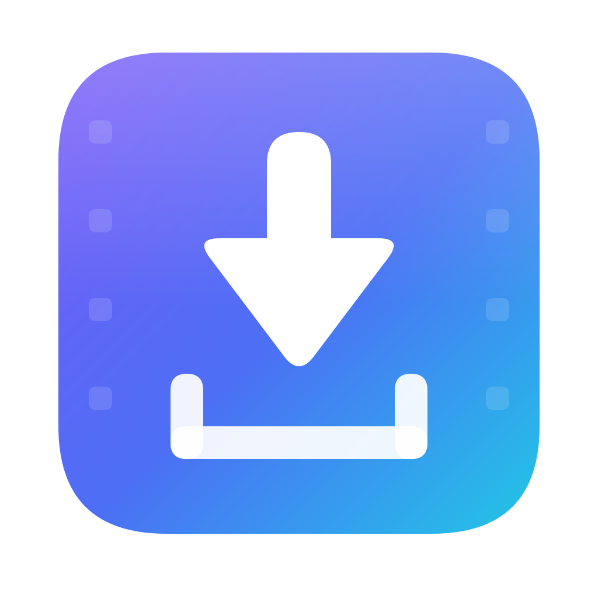

<div align="center">



# YTDLP GUI

**A native macOS, iPhone and iPad front end for [yt-dlp](https://github.com/yt-dlp/yt-dlp).**

Paste a link, pick a quality, click Download. Everything else stays out of the way
until you ask for it.


</div>

---

## Overview

YTDLP GUI is a SwiftUI application that drives the `yt-dlp` command-line tool through a proper
Mac interface. It parses yt-dlp's output into real UI state — a progress bar, a transfer rate,
an estimated time, a named post-processing stage — instead of dumping terminal text into a
window. Errors arrive as sentences a person can act on, with the original output one click away.

On the Mac the app is a front end only. It does not bundle, vendor or install `yt-dlp`: it
drives the copy you install yourself, so you decide when it updates and where it comes from.

iPhone and iPad can't launch other programs, so the [iOS app](#iphone-and-ipad) is different: it
carries its own copy of yt-dlp, running inside an embedded Python interpreter, and does with
Apple's media frameworks what ffmpeg does on the Mac.

## Features

### The basics

- URL field with paste, drag-and-drop and clipboard detection
- **Analyze** a link to see the title, thumbnail, channel, duration, resolution, chapters,
  subtitle languages and every available format before committing
- Video presets: Best, 4K, 1440p, 1080p, 720p, 480p — with a container preference of MP4, MKV,
  WebM or automatic
- Audio presets: Best (no re-encode), MP3, M4A, FLAC, WAV, Opus — with a selectable bitrate
  where it actually applies
- Output folder picker with a live filename-template field and ready-made template presets

### Download queue

- Multiple simultaneous downloads with a configurable limit (1–8)
- Per-item thumbnail, title, phase, percentage, speed, ETA and transferred/total size
- Distinct phases: downloading, merging, extracting audio, embedding artwork, writing metadata,
  removing segments, finishing up
- Cancel, retry, remove, clear finished, reveal in Finder
- An expandable raw log per item, with filtering and copy

### Advanced options

Subtitles (uploaded, auto-generated or both, with language selection and embedding) · embed
thumbnail, metadata and chapters · write thumbnail and `.info.json` · SponsorBlock marking or
removal with per-category selection · playlist downloading with item ranges · download archive ·
cookies from browser · rate limit · parallel fragments · proxy · user agent · ASCII-only
filenames · overwrite behaviour · and a free-form field for any other yt-dlp argument.

A **command preview** shows the exact command before it runs, and it is generated from the same
argument array that is handed to the process — not a reconstruction.

### History

Every finished download is recorded locally with its title, source URL, output path, date,
format and outcome. Search it, reveal the file in Finder, copy the original URL, or download it
again with the exact options used the first time. Entries whose file has since moved are
flagged.

### Dependency management

The app finds `yt-dlp` and `ffmpeg` in the usual Homebrew, MacPorts and pip locations, shows
their versions, and lets you point at a specific executable. It can update yt-dlp for you, and
it is Homebrew-aware: a Homebrew install is upgraded with `brew upgrade yt-dlp` rather than
`yt-dlp --update`, which would leave the formula out of step.

### macOS integration

Sidebar navigation · standard Settings window · menu bar commands · keyboard shortcuts ·
drag-and-drop · Finder reveal · local notifications · full Dark Mode · accessibility labels on
every control · tooltips throughout.

## Screenshots

> Add screenshots here. Suggested set:
>
> | | |
> |---|---|
> | `Docs/screenshot-download.png` | The download screen with a link analyzed |
> | `Docs/screenshot-queue.png` | The queue mid-download, showing speed and ETA |
> | `Docs/screenshot-history.png` | History with a search in progress |
> | `Docs/screenshot-settings.png` | The yt-dlp settings pane |

## Requirements

| | |
|---|---|
| **macOS** | 14.0 Sonoma or later |
| **Architecture** | Apple silicon and Intel |
| **Xcode** | 16 or later (to build) |
| **yt-dlp** | Required, installed separately |
| **ffmpeg** | Strongly recommended — needed to merge video with audio and to convert audio |

## Installing the tools

Both dependencies come from [Homebrew](https://brew.sh):

```bash
brew install yt-dlp ffmpeg
```

Or individually:

```bash
brew install yt-dlp
```

```bash
brew install ffmpeg
```

Without ffmpeg the app still works, but it can only download formats that already have video and
audio muxed together — which on most sites means a noticeable quality ceiling. The app says so
plainly when ffmpeg is missing rather than silently downloading something worse.

If yt-dlp lives somewhere unusual (pipx, a custom prefix, a manually downloaded binary), point
the app at it in **Settings › yt-dlp › Choose Executable**.

## Building

```bash
git clone https://github.com/<your-account>/YTDLP-GUI.git
```

```bash
cd YTDLP-GUI && open YTDLPGUI.xcodeproj
```

Then press ⌘R. The project uses ad-hoc code signing (`CODE_SIGN_IDENTITY = "-"`) so it builds
and runs without a developer account or team.

From the command line:

```bash
xcodebuild -scheme YTDLPGUI -configuration Release build
```

### Running the tests

```bash
xcodebuild test -scheme YTDLPGUI -destination 'platform=macOS'
```

The suite covers argument construction, progress parsing, JSON decoding, error classification,
line splitting, argument tokenising and formatting. There is also an integration suite that
drives the real `yt-dlp` binary end to end — it generates a short clip with ffmpeg and downloads
it over a `file://` URL, so it needs no network. That suite skips itself automatically if
yt-dlp or ffmpeg aren't installed.

## Usage

1. **Paste** a URL — ⇧⌘V, or drop a link onto the window.
2. **Analyze** it if you want to see what's on offer first (⌘I). Optional.
3. **Choose** Video or Audio and pick a quality.
4. **Download** (⌘↩). The item appears in the queue with live progress.

### Keyboard shortcuts

| Shortcut | Action |
|---|---|
| ⇧⌘V | Paste URL |
| ⌘I | Analyze URL |
| ⌘↩ | Start download |
| ⌘O | Choose output folder |
| ⇧⌘O | Reveal output folder in Finder |
| ⌘K | Clear the URL field |
| ⌘. | Cancel all downloads |
| ⌘1 / ⌘2 / ⌘3 | New Download / Queue / History |
| ⌘, | Settings |

### Filename templates

The output template is passed straight to yt-dlp's `--output`, so the
[full template syntax](https://github.com/yt-dlp/yt-dlp#output-template) is available. Common
placeholders are listed in the app under **Template placeholders**.

```
%(title)s.%(ext)s                                     Me at the zoo.mp4
%(uploader)s - %(title)s.%(ext)s                      jawed - Me at the zoo.mp4
%(playlist_title)s/%(playlist_index)02d - %(title)s.%(ext)s
```

## iPhone and iPad

The iOS app is the same product — paste a link, pick a quality, download — rebuilt around one
hard constraint: an iOS app cannot launch another program. There is no `Process`, no Homebrew
and no ffmpeg, so the app carries its own engine:

- **yt-dlp runs in-process**, in an embedded CPython 3.14
  ([BeeWare's `Python.xcframework`](https://github.com/beeware/Python-Apple-support)).
- **AVFoundation replaces ffmpeg** for merging video with audio, extracting and converting audio,
  embedding metadata, artwork and chapters, and cutting SponsorBlock segments.
- **JavaScriptCore solves YouTube's JavaScript challenges**, through a yt-dlp challenge provider
  the app registers as the `jsc` runtime.

[`Docs/iOS-Architecture.md`](Docs/iOS-Architecture.md) is the full design, including the JSON
protocol between Swift and Python.

### How it differs from the Mac app

| | macOS | iPhone and iPad |
|---|---|---|
| **yt-dlp** | Your own install | Bundled; updatable from **Settings › Engine** |
| **Video** | MP4, MKV, WebM or automatic | MP4 only (H.264 or HEVC; AV1 on devices that decode it in hardware) |
| **Audio** | Best, MP3, M4A, FLAC, WAV, Opus | Best, M4A (AAC), ALAC, FLAC, WAV — iOS has no MP3 or Opus encoder |
| **Subtitles** | Saved or embedded | Saved as separate files beside the download |
| **Cookies** | Read from a browser | An imported `cookies.txt` file |
| **Output** | Any folder | The app's Documents folder |

Options saved with MP3 or Opus (by an older build, say) become M4A rather than failing.

### Where downloads go

Finished files appear in **Files › On My iPhone (or iPad) › YTDLP GUI**. Partial downloads stay
in the app's caches until they finish, so the Files app only ever shows complete files;
**Settings › Storage** can clear what cancelled downloads leave behind. Videos can also be
saved to Photos automatically (**Settings › Downloads**).

### Links from other apps

- **Share sheet** — share a page or video to **YTDLP GUI** and choose Download Video, Download
  Audio or Add. The links wait in a shared inbox and are picked up the next time the app opens.
  The inbox needs an App Group; builds without one (see [Signing](#signing)) offer **Copy Link**
  instead.
- **Shortcuts and Siri** — the **Download with YTDLP GUI** action takes a link and Video or
  Audio, and starts the download.
- **URL scheme** — `ytdlpgui://download?url=<percent-encoded URL>&kind=video|audio` fills in the
  Download screen. It never starts a download by itself, so a web page can't.

### Cookies

Browsers' cookie stores aren't reachable from an iOS app. Sign in on a computer, export the
site's cookies in Netscape (`cookies.txt`) format with a browser extension, move the file to the
device, and import it in **Settings › Cookies**. The app validates it and keeps its own copy,
excluded from device backups. Every download reads that copy fresh: yt-dlp's end-of-download
cookie updates are never written back, so simultaneous downloads can't corrupt it.

### Keeping yt-dlp up to date

Extractors break whenever sites change. **Settings › Engine › Check for Updates** looks for the
newest yt-dlp on PyPI; installing it downloads the wheel and the yt-dlp-ejs release it needs,
checks both against the SHA-256 digests PyPI publishes, and takes effect the next time the app
opens. If an update ever fails to load, the app falls back to the bundled copy and says so.
**Use Bundled Version** switches back to the bundled copy from the next launch. Both are safe while
downloads run: the files the running engine uses are left alone until the app next opens.

### Background downloads

On iOS 26 and later a download started in the foreground keeps running in the background, with
the system's progress UI. Earlier versions get iOS's usual short grace period, after which a
download pauses and resumes from its partial file when you return. The screen can be kept awake
while downloads run (**Settings › Downloads**).

### Requirements

| | |
|---|---|
| **iOS / iPadOS** | 18.0 or later |
| **Xcode** | 16 or later (to build), on a Mac |
| **Network** | Once, to fetch the Python runtime and wheels |

### Building for iOS

The Python runtime and the Python packages are not committed. Fetch them once, and again
whenever the pins in the script change:

```bash
./Tools/fetch-ios-dependencies.sh
```

It downloads BeeWare's Python support package and the yt-dlp, yt-dlp-ejs and certifi wheels,
verifies each against a pinned SHA-256 digest, and unpacks them into the git-ignored `Vendor/`
folder. A build phase (`Tools/install-ios-python.sh`) then installs them into the app bundle.

Open `YTDLPGUI.xcodeproj`, choose the **YTDLPGUI-iOS** scheme and a device, and run.

### Signing

The iOS targets need a development team. Pass yours on the command line rather than writing it
into the project:

```bash
xcodebuild -scheme YTDLPGUI-iOS -destination 'id=<device id>' -allowProvisioningUpdates \
  DEVELOPMENT_TEAM=<team id> build
```

With a **free Personal Team**, also pass `CODE_SIGN_ENTITLEMENTS=` (empty). Personal Teams can't
use App Groups, so the build drops the `group.io.github.ytdlpgui.YTDLPGUI` group and the Share
extension falls back to **Copy Link**. Apps signed that way also stop launching after seven days
and have to be reinstalled. A paid Apple Developer Program team keeps the App Group, and with it
the share inbox.

### Distribution

The iOS app is for sideloading only: build it yourself, or distribute it through your own
development or ad-hoc signing. App Review Guideline 5.2.3 rejects apps that download media from
third-party sources such as YouTube without their authorisation, so it can't go on the App Store.

### Running the iOS tests

```bash
# Unit and integration tests, on a connected device
xcodebuild test -scheme YTDLPGUI-iOS -destination 'id=<device id>' \
  -allowProvisioningUpdates DEVELOPMENT_TEAM=<team id> CODE_SIGN_ENTITLEMENTS= \
  -only-testing:YTDLPGUI-iOSTests
```

```bash
# The Python side of the engine, on the Mac
PYTHONPATH=Vendor/python-packages:PythonHost python3.14 -m unittest discover -s PythonHost/tests -t PythonHost
```

The integration tests drive the real embedded engine end to end — an HTTP download from a local
server, a DASH merge through AVFoundation, audio extraction, cancellation and concurrent
downloads — without touching the internet. Tests against YouTube itself and a UI walkthrough run
only when `TEST_RUNNER_YTDLPGUI_LIVE_TESTS=1` is set. The Python tests generate their media fixtures
with ffmpeg; without it, the tests that need fixtures are skipped.

## Architecture

MVVM, with a strict separation between the code that talks to yt-dlp and the code that draws
the interface. Everything is `@MainActor` except the child processes themselves, whose output
arrives as an `AsyncStream`, which keeps the model single-threaded and free of locks.

The code is split between what both apps share and what each platform does its own way:

```
Shared/                      Platform-neutral Swift, compiled into both apps
├── Models/                  Options, media info, progress, failures, history
├── Services/                ArgumentBuilder (+Embedded for iOS), ProgressParser, HistoryStore
└── Utilities/               CustomArgumentPolicy, formatters, quoting, URL detection
YTDLPGUI/                    The macOS app (below)
YTDLPGUI-iOS/                The iOS app
├── App/                     Entry point, AppModel (composition root), link handling
├── Engine/
│   ├── Runtime/             C bridge to CPython, YTDLPEngine, request routing
│   ├── JavaScript/          JavaScriptCore runner for YouTube's challenge solver
│   └── Media/               AVFoundation replacements for ffmpeg
├── ViewModels/              DownloadQueue, DownloadComposer, EngineController
├── Services/                Settings, notifications, Photos, storage, cookies, background work
├── Intents/                 The Shortcuts action
└── Views/                   SwiftUI, grouped by screen
YTDLPGUI-iOS-Share/          Share extension
YTDLPGUI-iOSTests/           iOS unit and integration tests
YTDLPGUI-iOSUITests/         UI walkthrough (live tests only)
PythonHost/ytdlpgui_host/    The Python side of the iOS engine, bundled into the app
PythonHost/tests/            Its tests, run on the Mac
Tools/                       Icon generator, iOS dependency fetcher and install phase
```

The macOS app:

```
YTDLPGUI/
├── App/              Entry point, composition root, menu commands
├── Models/           Value types: options, media info, progress, failures, history
├── Services/         Everything that touches the outside world
│   ├── ProcessRunner.swift    Safe Process wrapper → AsyncStream of line events
│   ├── ToolLocator.swift      Finds yt-dlp / ffmpeg / brew
│   ├── ArgumentBuilder.swift  DownloadOptions → [String]  (pure)
│   ├── ProgressParser.swift   yt-dlp output → structured events  (pure)
│   ├── YTDLPService.swift     Metadata, downloads, updates
│   ├── HistoryStore.swift     JSON persistence
│   ├── AppSettings.swift      UserDefaults-backed preferences
│   └── NotificationService.swift
├── ViewModels/       Toolchain, DownloadQueue, DownloadComposer
├── Views/            SwiftUI, grouped by screen
└── Utilities/        Formatters, URL detection, quoting, Finder helpers
```

### Notable decisions

**Progress is parsed, not scraped.** yt-dlp runs with `--newline` and a custom
`--progress-template` that emits tab-separated machine-readable fields, plus a second template
for post-processing stages. Missing values arrive as the literal `NA` and become `nil`, so the
UI shows an indeterminate bar rather than a fake zero. The human-readable `[download]`,
`[Merger]` and `[ExtractAudio]` lines are parsed too, because they are the only place yt-dlp
reveals the final output path — which is what "Reveal in Finder" needs after a merge or an audio
conversion renames the file.

**No shell, ever.** Commands are launched with `Process.executableURL` and a fully-formed
`Process.arguments` array. Nothing is ever passed to `bash -c`, so a URL, a path, a filename
template or a custom argument cannot be reinterpreted as shell syntax. The free-form arguments
field is tokenised by a small parser that understands quotes and backslashes but performs no
expansion — no globbing, no variables, no command substitution. The URL is always passed after a
`--` separator so that a leading dash cannot become a flag. The command preview is shell-quoted
purely so it reads well and can be pasted into Terminal.

**The App Sandbox is deliberately off.** A sandboxed process may not execute arbitrary binaries
outside its container, which is precisely what this app exists to do. The app is distributed
outside the Mac App Store; the Hardened Runtime is enabled for Release builds so it can still be
notarized. See `YTDLPGUI/YTDLPGUI.entitlements`.

**A deliberately minimal child environment.** An app launched from Finder inherits almost no
useful `PATH`, so the child process is given an explicit one covering the standard package
manager locations, plus `--ffmpeg-location` when ffmpeg's path is known. `PYTHONUNBUFFERED` and
`PYTHONIOENCODING` are set so progress arrives line by line and non-ASCII titles survive.

**JSON is decoded leniently.** yt-dlp's output comes from over a thousand independent
extractors, and field presence and even field *types* vary between them. Every value is read
permissively and a missing or oddly-typed field never fails the whole decode.

**History is plain JSON, not SwiftData.** The data is a flat, append-mostly list of at most a
few thousand rows with no relationships and no migration story. A plain file at
`~/Library/Application Support/YTDLPGUI/history.json` is easier to inspect, back up and delete.
A corrupt file is moved aside rather than silently discarded.

### The application icon

The icon is generated programmatically — there is no binary source artwork to keep in sync.
`Tools/GenerateAppIcon.swift` defines the design once as a list of primitives and renders it
twice: through Core Graphics for every required PNG size, and as SVG markup for the vector
master. Fine detail (the film-strip perforations) is suppressed below 128px, where it would only
read as grit.

```bash
./Tools/generate-app-icon.sh
```

That rewrites:

- the macOS icon: `YTDLPGUI/Assets.xcassets/AppIcon.appiconset/` (PNGs plus `Contents.json`),
  `Icon/AppIcon.svg` and `Icon/AppIcon.icns`;
- the iOS icon: `YTDLPGUI-iOS/Assets.xcassets/AppIcon.appiconset/`, a full-bleed 1024px square
  (iOS applies the rounded mask itself) in the light, dark and tinted Home Screen appearances,
  with the light one kept opaque because the App Store rejects an icon with an alpha channel;
- the iOS accent colour: `YTDLPGUI-iOS/Assets.xcassets/AccentColor.colorset/`, the icon's indigo
  adjusted for contrast in light and dark mode.

It needs nothing but a Swift toolchain.

## Contributing

Issues and pull requests are welcome.

- Keep the dependency list empty. The macOS app deliberately uses only Apple frameworks; the
  iOS app adds only the runtime it can't do without (Python and the wheels pinned in
  `Tools/fetch-ios-dependencies.sh`).
- Pure logic belongs in `Services/` with tests. `ArgumentBuilder` and `ProgressParser` are pure
  functions specifically so they can be tested without launching anything.
- If you change how a command is built, add a test that asserts the resulting argument array.
  The command preview is a user-facing promise about what will run.
- Match the surrounding style: comments explain *why*, not *what*.
- Run `xcodebuild test -scheme YTDLPGUI -destination 'platform=macOS'` before opening a PR, and
  the Python host tests if you touched `PythonHost/`. `Shared/` is compiled into both apps, so a
  change there has to build for iOS too.

## Troubleshooting

**"Sign in to confirm you're not a bot"** — the site is gating requests. Turn on
**Advanced Options › Use cookies from browser** and pick a browser you're signed into. Updating
yt-dlp often helps too, since these checks change frequently.

**A download that used to work now fails** — update yt-dlp
(**Settings › yt-dlp › Update yt-dlp**). Extractors break whenever a site changes, and yt-dlp
ships fixes constantly.

**Quality is lower than expected** — check that ffmpeg is installed. Without it, only
pre-combined formats are available.

**Nothing happens when I click Download** — check the sidebar's dependency status. If yt-dlp is
missing, the app shows a setup screen with the install command.

## License

Released under the [MIT License](LICENSE).

The iOS app bundles third-party components, each under its own licence, which the app lists in
**Settings › Acknowledgements**:

| Component | Licence |
|---|---|
| [Python](https://www.python.org) 3.14 | PSF License |
| [BeeWare Python-Apple-support](https://github.com/beeware/Python-Apple-support) | BSD-3-Clause |
| [yt-dlp](https://github.com/yt-dlp/yt-dlp) | Unlicense |
| [yt-dlp-ejs](https://github.com/yt-dlp/ejs) | Unlicense; its solver bundles meriyah (ISC) and astring (MIT) |
| [certifi](https://github.com/certifi/python-certifi) | MPL-2.0 |
| OpenSSL | Apache-2.0 |
| libFFI | MIT |
| BZip2 | bzip2 licence |
| XZ Utils | 0BSD |
| mpdecimal | BSD-2-Clause |
| Zstandard | BSD-3-Clause |
| SQLite | Public domain |

The Python-based components come from BeeWare's support package, which builds them for iOS.

## A note on affiliation

This project is an independent, unofficial graphical front end. It is **not affiliated with,
endorsed by, or connected to YouTube, Google, or the yt-dlp project** in any way. yt-dlp and
ffmpeg are separate projects distributed under their own licenses. The macOS app neither
bundles nor redistributes them; the iOS app bundles an unmodified copy of yt-dlp under its
Unlicense and does not include ffmpeg at all.

You are responsible for how you use it. Respect the terms of service of the sites you download
from and the copyright of the material you download.
